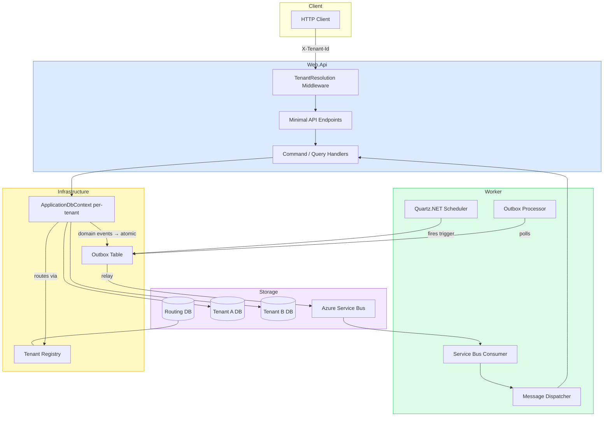

# Meridian

A production-grade, multi-tenant SaaS backend built on .NET 10 — designed as a portfolio project to demonstrate senior-level engineering across distributed systems, domain-driven design, and clean architecture.

The domain: a platform for managing automated background jobs (scheduled tasks with ordered steps) and personal todos. The real focus is the infrastructure beneath it — reliable message delivery, per-tenant isolation, crash-safe scheduling, and a clean architecture that two different hosts share without duplicating business logic.

---

## What This Demonstrates

### Distributed Systems & Reliability
- **Outbox pattern** — domain events and scheduled triggers are written to the database in the same transaction as the business change. A background relay publishes them to Azure Service Bus. Messages are never lost, even if the broker is temporarily unavailable.
- **Three-phase outbox relay** — Claim (short lock), Relay (publish outside any transaction), Persist (mark relayed). A reaper thread resets rows stuck mid-relay after a worker crash. No long-held locks, no duplicates.
- **Crash-safe scheduling** — Quartz.NET fires triggers into the outbox, not directly to ASB. A scheduler pod restart replays nothing — the outbox holds the record.
- **Optimistic concurrency** — every entity carries a SQL Server `rowversion`. Stale-write collisions return `409 Conflict` globally; handlers never catch this themselves.

### Multi-Tenancy
- Each tenant has a **dedicated SQL Server database** — no shared schema, no row-level security complexity, no risk of cross-tenant data leakage.
- A shared routing database maps tenant IDs to connection strings, cached in-memory per tenant.
- `TenantContext` is scoped per HTTP request (Web.Api) or per message (Worker). No ambient state. No thread-local tricks. Every repository receives `tenantId` explicitly.
- Azure Service Bus queues are provisioned **per tenant** at Worker startup. `MaxConcurrentCalls = 2` per processor means one tenant's load cannot starve another.

### Clean Architecture — Two Hosts, One Codebase
- Web.Api and Worker are two **hosts for the same application**. Both reference the same Application and Infrastructure layers. Zero business logic is duplicated.
- `IJobQueue` abstraction switches between in-memory (local dev, zero Azure dependencies) and Azure Service Bus (production) via a single config flag.
- Architecture tests (`NetArchTest`) enforce layer boundaries and fail the build if a dependency flows the wrong way.

### Domain-Driven Design
- Aggregates enforce invariants. `Job` owns `JobSchedule` and `JobStep` — all mutations go through the root (`job.AddSchedule()`, `job.ReorderSteps()`). Child entities are never mutated directly.
- Domain events are raised inside the aggregate via `Raise()`. `SaveChangesAsync` intercepts them and converts to `OutboxMessage` records atomically — the application layer never manages this manually.
- `JobScheduleChangedHandler` listens for schedule domain events and syncs the Quartz in-memory scheduler immediately — no restart, no polling lag.

### CQRS Without a Framework
- Commands and queries are separated into `ICommandHandler<,>` and `IQueryHandler<,>`.
- Cross-cutting concerns (validation, logging) are implemented as **decorators** registered via Scrutor assembly scanning — not MediatR pipeline behaviors.
- Handlers are `internal sealed`. Validators are auto-discovered from the Application assembly.

### Bulk Operations — Partial Success Pattern
- Bulk endpoints process valid items and report failures per-item with their index and ID — a single invalid entry does not abort the batch.
- Two validation layers: a top-level validator (via `ValidationDecorator`) fails the whole request if the envelope is malformed; a per-item validator runs inside the handler loop without short-circuiting.

---

## Architecture



### Layer Dependency Rule

```
SharedKernel → Domain → Application → Infrastructure → Web.Api / Worker
```

See [docs/ARCHITECTURE.md](docs/ARCHITECTURE.md) for sequence diagrams, domain model, and message flow breakdowns.

---

## Tech Stack

| Category | Technology |
|---|---|
| Runtime | .NET 10 |
| Web | ASP.NET Core Minimal API |
| ORM | Entity Framework Core + SQL Server |
| Scheduling | Quartz.NET (in-memory store) |
| Messaging | Azure Service Bus (Standard) |
| Validation | FluentValidation |
| DI & Decorators | Scrutor |
| Orchestration | .NET Aspire |
| Observability | OpenTelemetry (traces, metrics, logs via OTLP) |
| API Docs | Scalar |
| Testing | xUnit · Testcontainers · NetArchTest · Shouldly · NSubstitute |

---

## Project Structure

```
src/
├── SharedKernel/          ← Entity, Result<T>, IDomainEvent, IAuditableEntity
├── Domain/                ← Job, TodoItem, User aggregates and domain events
├── Application/           ← CQRS handlers, validators, abstractions (no infrastructure)
├── Infrastructure/        ← EF Core, Auth, Outbox, Tenancy, Quartz — shared by both hosts
├── Web.Api/               ← Minimal API endpoints, tenant middleware
├── Worker/                ← Quartz scheduler, outbox relay, ASB consumers
├── Aspire.AppHost/        ← Local dev orchestration
└── Aspire.ServiceDefaults/

tests/
├── ArchitectureTests/             ← Layer boundary enforcement via NetArchTest
├── Application.UnitTests/
├── Application.IntegrationTests/  ← Real SQL Server via Testcontainers
├── Worker.UnitTests/
└── Worker.IntegrationTests/
```

---

## Running Locally

### Prerequisites
- [.NET 10 SDK](https://dotnet.microsoft.com/download)
- [Docker Desktop](https://www.docker.com/products/docker-desktop)
- Azure Service Bus namespace with a connection string (Standard tier) — or skip it entirely with the flag below

> **Note:** Azure Service Bus integration uses a real connection string, not the local emulator.

### Start

```bash
git clone https://github.com/your-username/Meridian.git
cd Meridian
dotnet run --project src/Aspire.AppHost
```

Aspire provisions SQL Server containers and three databases (`routing-db`, `tenant-a`, `tenant-b`) automatically. No manual setup.

To run without Azure Service Bus:

```json
// src/Worker/appsettings.Development.json
{ "Worker": { "UseLocalJobQueue": true } }
```

### Build & Test

```bash
dotnet build Meridian.sln
dotnet test Meridian.sln
```

Integration tests spin up and tear down SQL Server containers automatically via Testcontainers.

### Add a Migration

```bash
dotnet ef migrations add MigrationName \
  --project src/Infrastructure \
  --startup-project src/Web.Api \
  --context ApplicationDbContext
```

---

## API Overview

All endpoints require `Authorization: Bearer <token>` except `/users/register` and `/users/login`.
Tenant is resolved from the `X-Tenant-Id` header.
Interactive docs available at `/scalar/v1` when running locally.

**Jobs** — `POST /jobs` · `GET /jobs/{id}` · schedules CRUD + bulk · steps CRUD + bulk + reorder

**Todos** — `POST /todos` · `GET /todos` · `GET /todos/{id}` · `PUT /todos/{id}/complete` · `DELETE /todos/{id}`

**Users** — `POST /users/register` · `POST /users/login` · `GET /users/{id}`
