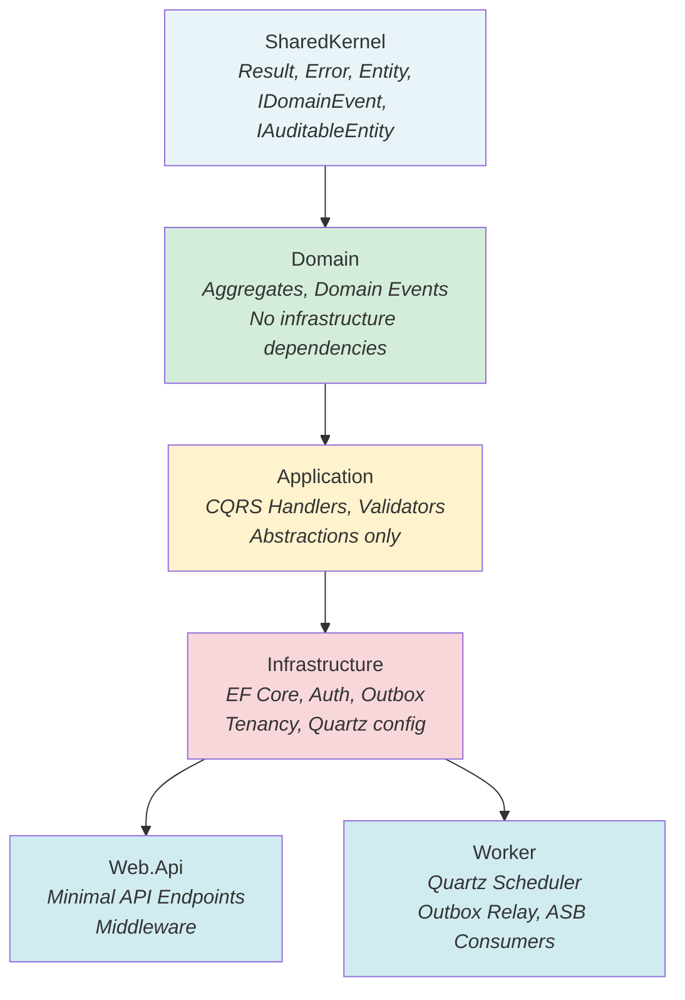
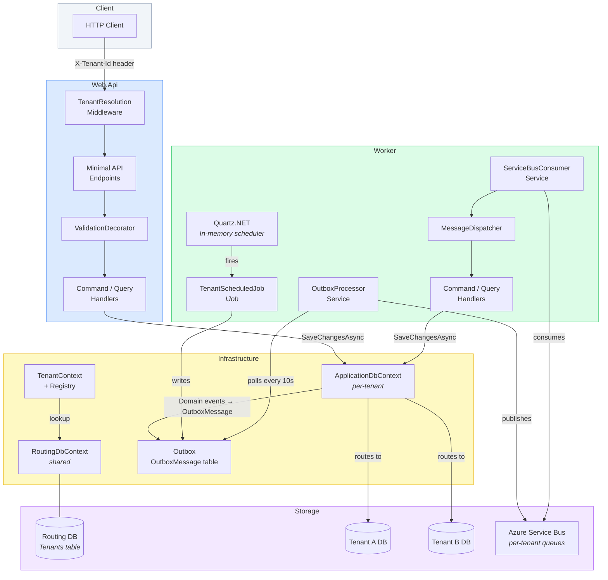
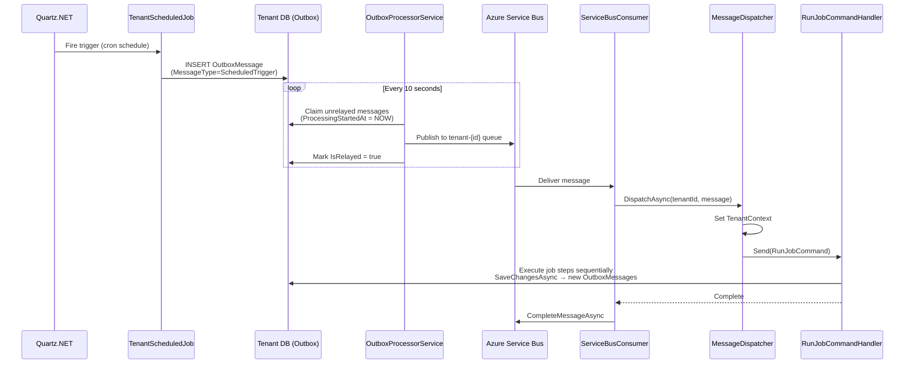
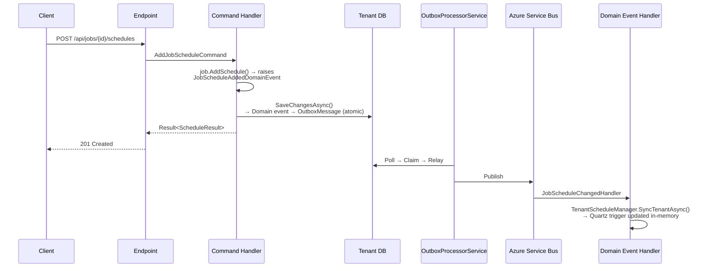
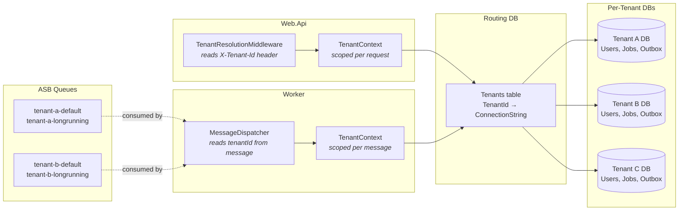

# DevHabit Architecture

Multi-tenant SaaS built on Clean Architecture. Each tenant has an isolated SQL Server database; a shared routing database maps tenant IDs to connection strings.

---

## Layer Dependencies

Web.Api and Worker are two different **hosts** for the same application. All business logic lives in Application and Domain — neither host duplicates it.

---

## System Overview

---

## Scheduled Job Execution Flow

---

## Domain Event Flow (API-Triggered)

---

## Multi-Tenancy Model

---

## Key Patterns

| Pattern | Where Used | Purpose |
|---|---|---|
| **Clean Architecture** | All layers | Isolated business logic, no leaky dependencies |
| **CQRS** | Application layer | Commands mutate state; queries read only |
| **DDD Aggregates** | Domain layer | `Job` owns `JobSchedule` and `JobStep`; mutations via root |
| **Outbox Pattern** | Infrastructure | Guaranteed domain event delivery; crash-safe |
| **Decorator Pattern** | Application layer | `ValidationDecorator`, `LoggingDecorator` wrap handlers |
| **Multi-Tenancy** | Infrastructure | Per-tenant database isolation via `TenantContext` |
| **Optimistic Concurrency** | All entities | SQL Server `rowversion` — 409 Conflict on stale writes |
| **Two-Phase Claim** | OutboxProcessorService | Claim → Relay → Persist; reaper recovers crashed workers |
| **Event-Driven Scheduling** | Worker | `JobScheduleChangedHandler` syncs Quartz without restart |
